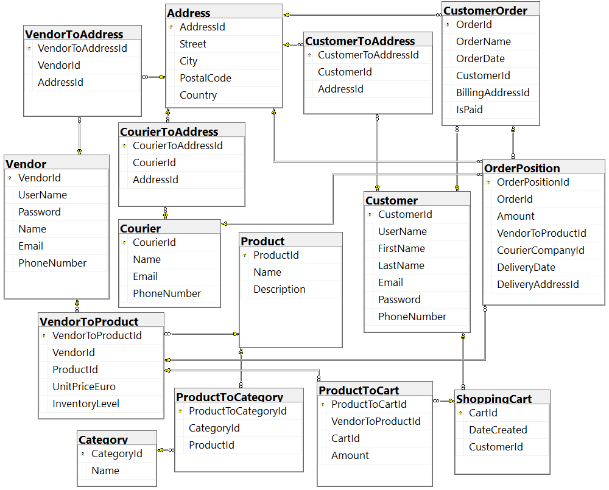
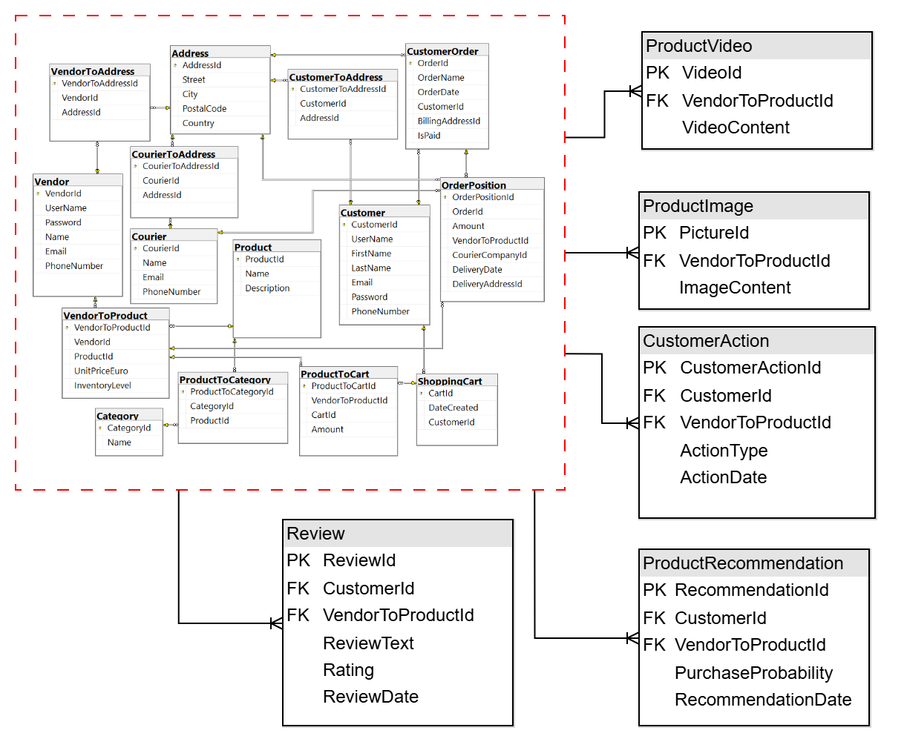

# Migration script
The following document describes the script that was used to migrate from the initial relational e commerce
model to the polyglot persistence model.
  Initial relational model

  The target model

## Prerequisites
* Python compiler
* Running MSSQL server
* Runnning MongoDB cluster
* Running Neo4j server

## Start the script
To run the script, it is assumed that the existing relational database has already been set up. 
If you want to run the script, you need to have a running *Microsoft SQL Server* database.
You also need a running *MongoDB* cluster.
You also need a running *Neo4j* instance.
Follow these steps to execute the migration script:

1. Install the following Python libraries:
	* pyodbc
	* pymongo
	* neo4j

2. If you do not have an existing relational database with the e commerce model, please execute this script
in your new database: [initial_database_sql_script.sql](./initial_database_sql_script.sql). 
Create a new database for the relations of the new polyglot persistence model.
Modify the connection string for the master database in the variable *master_db_conn_str* in
[migration.py](./migration.py).
Modify the connection string for the database with the e commerce model in the variable 
*ecommerce_db_conn_str* in [migration.py](./migration.py).
Modify the connection string for the database for the new polyglot persistence model in the variable 
*new_ecommerce_db_conn_str* in [migration.py](./migration.py).

3. Modify the connection data for the MongoDB instance in the variable *mongodb_connection* in 
[migration.py](./migration.py).

4. Modify the connection data for the Neo4j instance in the variable *neo4j_connection* in 
[migration.py](./migration.py).

5. Run the script [migration.py](./migration.py) with *python migration.py*.

